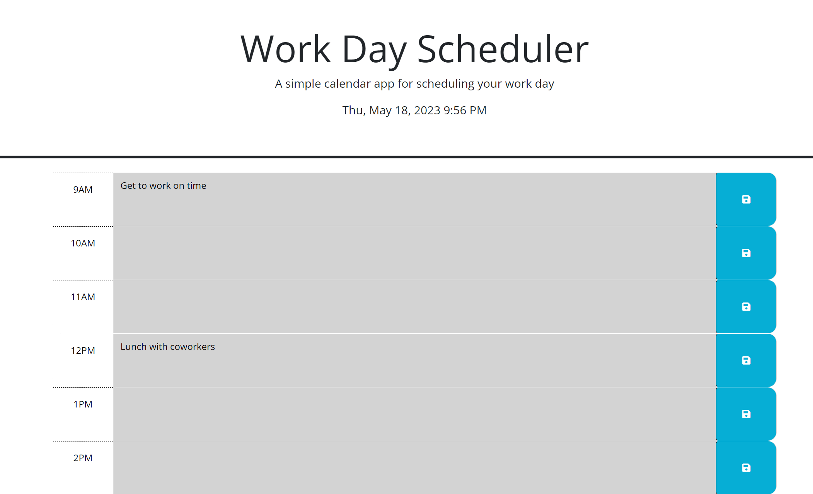

# workday-scheduler

## Application expectations: 
Web doc will load blank 9-5pm slots with current date and time. 
When user saves hourly description this will load on refresh or when revisiting the site.
Color of time blocks will change depending on past, present or future time.

## Technology used:
HTML, JS, CSS, DAYJS, Google Fonts

## Challenges: 
Creating the logic to get the web document to change color depending on the current time.
Getting local storage to save information.

## Errors:
DAYJS and chrome have an error that for this project I was told to not worry about for submission. 
It was not an error in my code but an error with the compatibility of the API and Chrome.

Github Deplyed Page
https://bosalinas.github.io/workday-scheduler/
